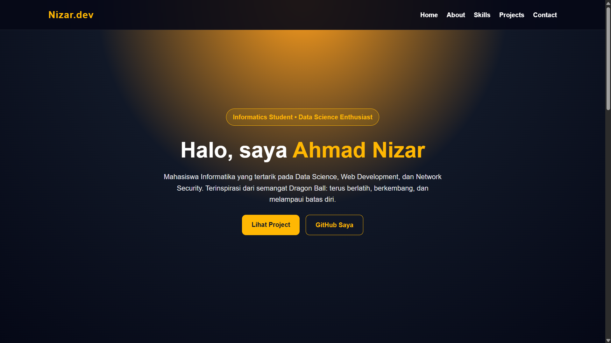

<div align="center">

# 🚀 Ahmad Nizar Portfolio

### Personal Portfolio Website | Informatics Student | Data Science Enthusiast


<br>


</div>

---

## 📖 About Project

This is my personal portfolio website built to showcase:

✨ My skills  
✨ Projects  
✨ Learning journey  
✨ Contact information  

Inspired by Dragon Ball philosophy:

> Keep training, keep improving, and surpass your limits.

---

## 🎯 Features

✅ Responsive design  
✅ Dark modern UI  
✅ Smooth scrolling navigation  
✅ Project showcase section  
✅ Skill section  
✅ Contact section  
✅ Dragon Ball inspired quotes  

---

## 🖼 Preview

Tambahkan screenshot website di folder:

```bash
assets/preview.png
```

Lalu aktifkan:

```md

```

---

## 🛠 Tech Stack

- HTML
- CSS
- JavaScript
- GitHub Pages

---

## 📂 Project Structure

```bash
portfolio/
│
├── index.html
├── style.css
├── script.js
├── assets/
│   └── preview.png
│
└── README.md
```

---

## ⚙ Installation

Clone repository:

```bash
git clone https://github.com/2023-Nizar-186/portfolio.git
```

Open folder:

```bash
cd portfolio
```

Run:

```bash
Open index.html
```

---

## 🌐 Live Demo

Coming Soon...

atau nanti ganti:

https://2023-nizar-186.github.io/portfolio/

---

## 👨‍💻 Author

**Ahmad Nizar**

GitHub:

https://github.com/2023-Nizar-186

---

<div align="center">

### ⚡ “Tidak perlu langsung menjadi Ultra Instinct. Yang penting naik level setiap hari.”

</div>
